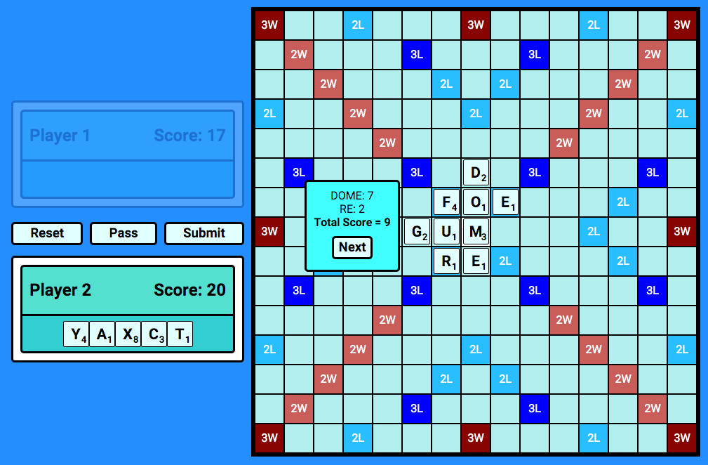

# Scrabble

A front-end two-player scrabble game created for General Assembly Web Development Immersive project submission using HTML, CSS and Javascript.

## Approach
- Scrabble board is created with DOM manipulation
- Scrabble tiles created with an array of objects with letter and score as properties
- User interaction created using Dragula drag and drop package
- Built scripts to read words from the board and check against Sowpods dictionary
- Automated testing and deployment workflow with GitHub, Travis and Heroku

## Tools and Libraries
- [Babelify](https://github.com/babel/babelify)
- [Browserify](https://github.com/substack/node-browserify)
- [brfs](https://github.com/substack/brfs)
- [watch-spawn](https://www.npmjs.com/package/watch-spawn)
- [lodash](https://lodash.com/)
- [HTTP Server](https://github.com/indexzero/http-server)
- [Travis CI](https://travis-ci.org/)
- [Heroku](https://www.heroku.com/)
- [Dragula](https://github.com/bevacqua/dragula)
